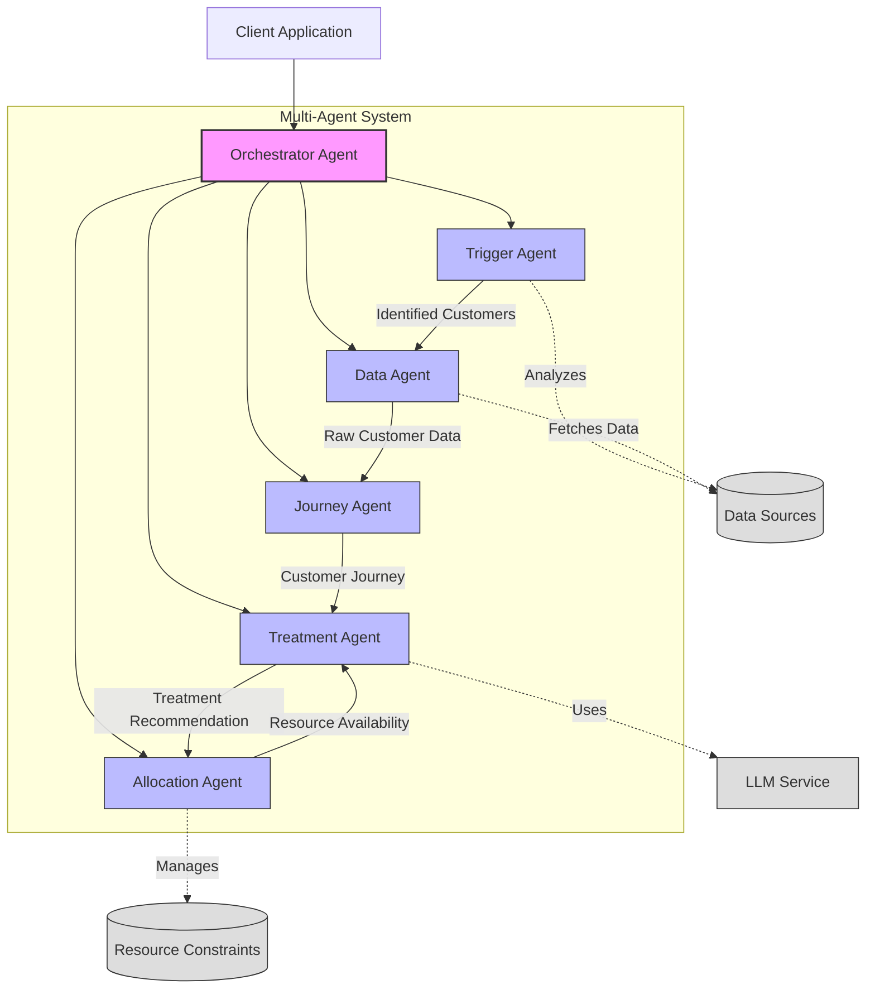

# An Agentic CVM System for a Telecommunications Company

This is a proof of concept for an Agentic CVM system for a telecommunications company. The goal of this project is to explore the use of Agentic AI to optimize and completely automate customer marketing decision making.

## Table of Contents
- [Quick Start](#quick-start)
- [Core Functionality](#core-functionality)
- [Multi-Agent Architecture](#multi-agent-architecture)
- [Usage Examples](#usage-examples)
- [Configuration](#configuration)
- [Streamlit UI](#streamlit-ui)
- [Development](#development)
- [Testing](#testing)
- [Debugging](#debugging)
- [Future Enhancements](#future-enhancements)
- [Contributing](#contributing)
- [License](#license)
- [Disclaimer](#disclaimer)

## Quick Start

### Prerequisites
- Python 3.10 or higher
- Poetry (Python package manager)
- Access to OpenAI API (for GPT-4 integration)

### Installation
```bash
# Clone the repository
git clone https://github.com/yourusername/cvm_agents.git
cd cvm_agents

# Install Poetry if not already installed
curl -sSL https://install.python-poetry.org | python3 -

# Add Poetry to your PATH
export PATH="$HOME/.local/bin:$PATH" 

# Install dependencies
poetry install 

# Set up environment variables
cp .env.example .env
# Edit .env with your API keys and configuration
```

## Core Functionality

Here are the main ways to use the CVM system:

### 1. Process Customer Journey with Multi-Agent System

Process individual customers or a batch of customers using the multi-agent architecture:

```bash
# Process a single customer
poetry run python src/cvm_processor_cli.py --customer_ids U124

# Process multiple customers
poetry run python src/cvm_processor_cli.py --customer_ids "U123,U124,U125" --output_file results.json

# Set custom log level
poetry run python src/cvm_processor_cli.py --customer_ids U124 --log_level DEBUG
```

### 2. Customer Triggering and Processing

Find customers meeting specific criteria and apply treatments to them:

```bash
# List available trigger types
poetry run python src/trigger_customers_cli.py list-triggers

# Find customers with network issues
poetry run python src/trigger_customers_cli.py trigger --all-customers --trigger-type network_issues

# Find customers with custom criteria and output to CSV
poetry run python src/trigger_customers_cli.py trigger --all-customers --trigger-type custom --description "Customers experiencing poor video call quality during business hours" --output csv --output-file network_issues.csv

# Process triggered customers with a specific treatment
poetry run python src/trigger_customers_cli.py process --all-customers --trigger-type network_issues --treatment service_sms
```

All output files are automatically saved to the `output` directory in the project root.

### 3. Dynamic Treatment Management

Create and manage custom treatments on-the-fly:

```bash
# Get help on treatment format
poetry run python src/dynamic_treatment_cli.py help

# Add a new custom treatment with simple text description
poetry run python src/dynamic_treatment_cli.py add "Send personalized video message to customer with limit 10 and priority 2"

# Add a custom treatment with JSON format
poetry run python src/dynamic_treatment_cli.py add '{
  "display_name": "VIP Gift Basket",
  "description": "Send a premium gift basket to high-value customers",
  "constraints": {
    "max_per_day": 5,
    "cost_per_contact_pounds": 50.0,
    "priority": 1
  }
}'

# List all treatments
poetry run python src/dynamic_treatment_cli.py list

# Update an existing custom treatment
poetry run python src/dynamic_treatment_cli.py update custom_send_personalized_vide_12345678 "Updated description with new limit 20"

# Remove a custom treatment
poetry run python src/dynamic_treatment_cli.py remove custom_send_personalized_vide_12345678

# Process a customer using all available treatments
poetry run python src/dynamic_treatment_cli.py process U124
```

### 4. View Customer Data

Examine a customer's journey data:

```bash
# View customer data
poetry run python src/cvm_processor_cli.py --customer_ids U124
```

### Key Features

The system uses advanced LLM-based analysis to identify and process customers based on various criteria:

1. **Built-in Triggers**:
   - Network quality issues
   - Billing disputes
   - High churn risk
   - High-value customers
   - Roaming issues

2. **Custom Triggers**:
   - Create custom triggers using natural language descriptions
   - LLM-powered semantic analysis of customer interactions
   - Flexible matching based on context and intent

3. **Treatment Application**:
   - Automated treatment selection
   - Resource constraint management
   - Permission-aware processing

## Multi-Agent Architecture

### Overview

The CVM multi-agent architecture divides the treatment selection process into specialized components, each responsible for specific aspects of the workflow. This modular approach improves maintainability, scalability, and allows for independent optimization of each component.

### Agent Architecture



### Agent Responsibilities

The system employs several specialized agents working together:

#### 1. Orchestrator Agent
- Central coordinator that manages the entire workflow
- Initializes and coordinates all other agents
- Defines the sequence of operations for processing customers
- Handles error recovery and fallback strategies

#### 2. Data Agent
- Responsible for all data access operations
- Retrieves and caches customer data from various sources
- Handles data transformation and normalization

#### 3. Journey Agent
- Builds and analyzes customer journeys
- Constructs comprehensive customer journey from raw data points
- Identifies patterns and trends in customer behavior
- Extracts key metrics and insights from journeys

#### 4. Treatment Agent
- Determines the optimal treatment for customers
- Uses LLMs to analyze customer journeys and determine best treatments
- Applies business rules and customer permissions to recommendations
- Finds alternative treatments when primary choices are unavailable

#### 5. Allocation Agent
- Manages resource allocation and constraints
- Tracks availability of limited resources (e.g., call center slots)
- Ensures thread-safe updates to resource constraints
- Implements priority-based allocation for high-value customers

#### 6. Trigger Agent
- Identifies customers who match specific criteria and need attention
- Uses both rule-based and LLM-powered analysis to identify customers
- Supports predefined trigger types and custom semantic triggers
- Analyzes customer interactions from multiple channels

### Benefits of the Multi-Agent Architecture

1. **Modularity**: Each agent focuses on a specific aspect of the overall system
2. **Scalability**: Agents can be scaled independently based on workload
3. **Maintainability**: Changes to one agent's implementation don't affect others
4. **Extensibility**: New capabilities can be added as new agent types
5. **Resilience**: Failures in one agent can be contained without crashing the entire system
6. **Optimization**: Each agent can be optimized for its specific task
7. **Reusability**: Agents can be reused across different workflows

## Configuration

The system is highly configurable through:
- `.env` file for environment variables
- `config/cvm_config.yaml` for system settings
- Custom treatment definitions in `config/custom_treatments.json`
- Resource constraints

### Environment Variables
The following environment variables are required:
```
OPENAI_API_KEY=your_api_key_here
MODEL_ID=gpt-4o
LOG_LEVEL=INFO
```

## Streamlit UI

The system includes a Streamlit-based web interface that provides an intuitive way to interact with the CVM system functionality.

### Running the UI

To launch the Streamlit UI:

```bash
# Start the UI on localhost:8501
poetry run python src/ui/launch_ui.py
```

Or directly with Streamlit:

```bash
poetry run streamlit run src/ui/app.py
```

### UI Features

The Streamlit UI provides the following capabilities:

1. **Dashboard** - Overview of the system status and key metrics
2. **Customer Processing** - Process individual customers through the CVM system
3. **Trigger Management** - Identify customers based on specific trigger criteria
4. **Treatment Management** - Add, update, list and remove treatments
5. **Batch Operations** - Process multiple customers with a selected treatment

### UI Screenshots


## Development

### Development Setup
1. Clone the repository
2. Install Poetry (if not already installed):
   ```bash
   curl -sSL https://install.python-poetry.org | python3 -
   ```
3. Install dependencies:
   ```bash
   poetry install
   ```
4. Set up pre-commit hooks (recommended):
   ```bash
   poetry run pre-commit install
   ```

### Project Structure
```
cvm_agents/
├── config/                 # Configuration files
│   ├── cvm_config.yaml    # Main configuration
│   └── custom_treatments.json # Custom treatment definitions
├── src/                   # Source code
│   ├── agents/           # Multi-agent architecture components 
│   │   ├── base_agent.py           # Base agent class
│   │   ├── orchestrator_agent.py   # Central coordinator
│   │   ├── data_agent.py           # Data retrieval
│   │   ├── journey_agent.py        # Journey building
│   │   ├── treatment_agent.py      # Treatment recommendations
│   │   ├── allocation_agent.py     # Resource allocation
│   │   └── trigger_agent.py        # Customer identification
│   ├── tools/            # Utility tools and APIs
│   │   └── api_v2.py     # Customer journey builder
│   ├── utils/           # Helper functions
│   │   ├── config.py            # Configuration handler
│   │   ├── treatment_manager.py # Treatment management
│   │   └── treatment_parser.py  # Custom treatment parsing
│   ├── cvm_processor_cli.py   # Multi-agent entry point
│   ├── trigger_customers_cli.py      # Customer triggering CLI
│   └── dynamic_treatment_cli.py      # Treatment management CLI
├── tests/                # Test suite
│   ├── agents/          # Agent tests
│   ├── utils/           # Utility tests
│   └── conftest.py      # Test configuration
├── output/              # Output files directory
├── .env.example         # Example environment variables
├── poetry.lock         # Lock file for dependencies
├── pyproject.toml      # Project metadata and dependencies
└── README.md          # This file
```

## Testing

The project uses pytest for testing. All agent components have comprehensive test coverage to ensure reliability.

### Running Tests
```bash
# Run all tests
poetry run pytest

# Run tests with verbose output
poetry run pytest -v

# Run tests with coverage report
poetry run pytest --cov=src

# Run tests for a specific module
poetry run pytest tests/utils/test_config.py

# Run tests for a specific agent with coverage details
poetry run pytest tests/agents/test_trigger_agent.py --cov=src.agents.trigger_agent --cov-report=term-missing
```

### Test Coverage

The project maintains high test coverage across all core components:

| Component | Coverage |
|-----------|----------|
| Base Agent | 96% |
| Data Agent | 100% |
| Journey Agent | 100% |
| Treatment Agent | 67% |
| Allocation Agent | 100% |
| Trigger Agent | 68% |
| Orchestrator Agent | 81% |

To improve coverage further, run tests with the `--cov-report=html` flag to generate a detailed HTML report:

```bash
poetry run pytest --cov=src --cov-report=html
```

## Debugging

Several debug options are available:

```bash
# Detailed debug output
poetry run python src/cvm_processor_cli.py --customer_ids U124 --log_level DEBUG

# Minimal output
poetry run python src/cvm_processor_cli.py --customer_ids U124 --log_level WARNING
```

### Debug logs
Debug logs are written to `logs/cvm.log` by default.

## Future Enhancements

The current implementation can be extended with:

1. **Evaluation Agent**: For assessing treatment effectiveness
2. **Customer Segmentation Agent**: For advanced customer categorization
3. **Messaging Infrastructure**: Replace direct method calls with message queues
4. **Distributed Processing**: Distribute agents across multiple servers
5. **A/B Testing Framework**: Test different agent strategies in parallel

## Contributing
1. Fork the repository
2. Create a feature branch
3. Commit your changes
4. Run the test suite
5. Submit a Pull Request

Please ensure your PR:
- Includes tests for new functionality
- Updates documentation as needed
- Follows the code style guidelines
- Includes a clear description of changes

## License
This project is licensed under the MIT License - see the LICENSE file for details.

## Disclaimer

This project is for educational and research purposes only.

- Not intended for real-world deployment.
- No warranties or guarantees provided.
- Creator assumes no liability for any losses.
- Consult a professional for real-world applications.
- By using this software, you agree to use it solely for learning purposes.