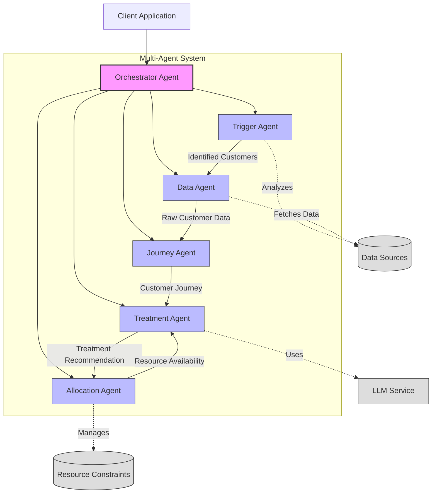
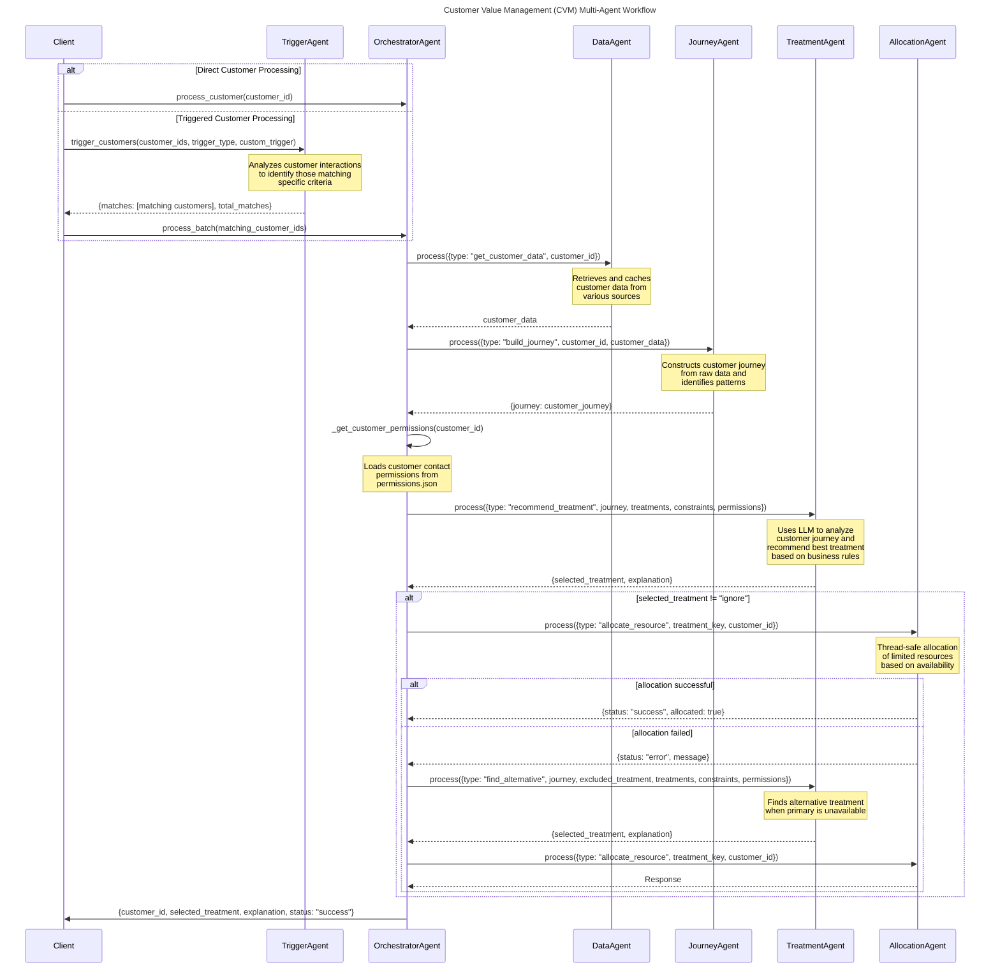

# CVM (Customer Value Management) System for a Telecommunications Company

This is a proof of concept for an Agentic CVM system for a telecommunications company. The goal of this project is to explore the use of Agentic AI to optimize and completely automate customer marketing decision making.

## Quick Start

### Prerequisites
- Python 3.10 or higher
- Poetry (Python package manager)
- Access to OpenAI API (for GPT-4 integration)

### Local Setup
```bash
# Add Poetry to your PATH
export PATH="$HOME/.local/bin:$PATH" 

# Install dependencies
poetry install 

# Set up environment variables
cp .env.example .env
# Edit .env with your API keys and configuration
```

## Core Functionality

Here are the main ways to use the CVM system:

### 1. Process Customer Journey with Multi-Agent System

Process individual customers or a batch of customers using the multi-agent architecture:

```bash
# Process a single customer
poetry run python src/cvm_processor_cli.py --customer_ids U124

# Process multiple customers
poetry run python src/cvm_processor_cli.py --customer_ids "U123,U124,U125" --output_file results.json

# Set custom log level
poetry run python src/cvm_processor_cli.py --customer_ids U124 --log_level DEBUG
```

### 2. Customer Triggering and Processing

Find customers meeting specific criteria and apply treatments to them:

```bash
# List available trigger types
poetry run python src/trigger_customers_cli.py list-triggers

# Find customers with network issues
poetry run python src/trigger_customers_cli.py trigger --all-customers --trigger-type network_issues

# Find customers with custom criteria and output to CSV
poetry run python src/trigger_customers_cli.py trigger --all-customers --trigger-type custom --description "Customers experiencing poor video call quality during business hours" --output csv --output-file network_issues.csv

# Process triggered customers with a specific treatment
poetry run python src/trigger_customers_cli.py process --all-customers --trigger-type network_issues --treatment service_sms
```

All output files are automatically saved to the `output` directory in the project root. For example, when generating CSV output:

```bash
# Find customers with custom criteria and output to CSV in the output directory
poetry run python src/trigger_customers_cli.py trigger --all-customers --trigger-type custom --description "Customers mentioning dogs or other pets" --output csv --output-file pet_interests.csv
```

This will create `output/pet_interests.csv` in the project root.

### 3. Dynamic Treatment Management

Create and manage custom treatments on-the-fly:

```bash
# Get help on treatment format
poetry run python src/dynamic_treatment_cli.py help

# Add a new custom treatment with simple text description
poetry run python src/dynamic_treatment_cli.py add "Send personalized video message to customer with limit 10 and priority 2"

# Add a custom treatment with JSON format
poetry run python src/dynamic_treatment_cli.py add '{
  "display_name": "VIP Gift Basket",
  "description": "Send a premium gift basket to high-value customers",
  "constraints": {
    "max_per_day": 5,
    "cost_per_contact_pounds": 50.0,
    "priority": 1
  }
}'

# List all treatments
poetry run python src/dynamic_treatment_cli.py list

# Update an existing custom treatment
poetry run python src/dynamic_treatment_cli.py update custom_send_personalized_vide_12345678 "Updated description with new limit 20"

# Remove a custom treatment
poetry run python src/dynamic_treatment_cli.py remove custom_send_personalized_vide_12345678

# Process a customer using all available treatments
poetry run python src/dynamic_treatment_cli.py process U124
```

### 4. View Customer Data

Examine a customer's journey data:

```bash
# View customer data
poetry run python src/cvm_processor_cli.py --customer_ids U124
```

## Key Features

### Customer Triggering and Processing
The system uses advanced LLM-based analysis to identify and process customers based on various criteria:

1. **Built-in Triggers**:
   - Network quality issues
   - Billing disputes
   - High churn risk
   - High-value customers
   - Roaming issues

2. **Custom Triggers**:
   - Create custom triggers using natural language descriptions
   - LLM-powered semantic analysis of customer interactions
   - Flexible matching based on context and intent

3. **Treatment Application**:
   - Automated treatment selection
   - Resource constraint management
   - Permission-aware processing

### Multi-Agent Architecture

The system employs a sophisticated multi-agent architecture:

1. **OrchestratorAgent**: Coordinates the overall workflow
2. **DataAgent**: Handles data access and caching
3. **JourneyAgent**: Builds and analyzes customer journeys
4. **TreatmentAgent**: Determines optimal treatments
5. **AllocationAgent**: Manages resource constraints
6. **TriggerAgent**: Identifies customers matching specific criteria

## Usage Examples

### Trigger Customers
```bash
# Trigger customers with network issues
poetry run python src/trigger_customers_cli.py trigger --trigger-type network_issues --all-customers

# Use custom trigger with semantic analysis
poetry run python src/trigger_customers_cli.py trigger --trigger-type custom --description "Customers experiencing poor video call quality during business hours" --all-customers
```

### Process Customers
```bash
# Process triggered customers with a specific treatment
poetry run python src/trigger_customers_cli.py process --trigger-type network_issues --all-customers --treatment service_sms

# Process with custom trigger and treatment
poetry run python src/trigger_customers_cli.py process --trigger-type custom --description "Customers with billing disputes over international charges" --all-customers --treatment retention_email
```

### View Customer Data
```bash
# View customer data
poetry run python src/cvm_processor_cli.py --customer_ids U124
```

## Configuration

The system is highly configurable through:
- `.env` file for environment variables
- `config/cvm_config.yaml` for system settings
- Custom treatment definitions
- Resource constraints

## Development

### Development Setup
1. Clone the repository
2. Install Poetry (if not already installed):
   ```bash
   curl -sSL https://install.python-poetry.org | python3 -
   ```
3. Install dependencies:
   ```bash
   poetry install
   ```
4. Set up pre-commit hooks (recommended):
   ```bash
   poetry run pre-commit install
   ```

### Running Tests
The project uses pytest for testing. To run the tests:

```bash
# Run all tests
poetry run pytest

# Run tests with verbose output
poetry run pytest -v

# Run tests with coverage report
poetry run pytest --cov=src

# Run tests for a specific module
poetry run pytest tests/utils/test_config.py
```

### Environment Variables
The following environment variables are required:
```
OPENAI_API_KEY=your_api_key_here
MODEL_ID=gpt-4o
LOG_LEVEL=INFO
```

### Project Structure
```
cvm_agents/
├── config/                 # Configuration files
│   ├── cvm_config.yaml    # Main configuration
│   └── custom_treatments.json # Custom treatment definitions
├── src/                   # Source code
│   ├── agents/           # Multi-agent architecture components 
│   │   ├── base_agent.py           # Base agent class
│   │   ├── orchestrator_agent.py   # Central coordinator
│   │   ├── data_agent.py           # Data retrieval
│   │   ├── journey_agent.py        # Journey building
│   │   ├── treatment_agent.py      # Treatment recommendations
│   │   ├── allocation_agent.py     # Resource allocation
│   │   └── trigger_agent.py        # Customer identification
│   ├── tools/            # Utility tools and APIs
│   │   └── api_v2.py     # Customer journey builder
│   ├── utils/           # Helper functions
│   │   ├── config.py            # Configuration handler
│   │   ├── treatment_manager.py # Treatment management
│   │   └── treatment_parser.py  # Custom treatment parsing
│   ├── cvm_processor_cli.py   # Multi-agent entry point
│   ├── trigger_customers_cli.py      # Customer triggering CLI
│   └── dynamic_treatment_cli.py      # Treatment management CLI
├── tests/                # Test suite
│   ├── agents/          # Agent tests
│   ├── utils/           # Utility tests
│   └── conftest.py      # Test configuration
├── .env.example         # Example environment variables
├── poetry.lock         # Lock file for dependencies
├── pyproject.toml      # Project metadata and dependencies
└── README.md          # This file
```

## Debugging
Several debug options are available:

```bash
# Detailed debug output
poetry run python src/cvm_processor_cli.py --customer_ids U124 --log_level DEBUG

# Minimal output
poetry run python src/cvm_processor_cli.py --customer_ids U124 --log_level WARNING
```

### Debug logs
Debug logs are written to `logs/cvm.log` by default.

## System Overview

This system employs several agents working together:

- **Offer Data Agent**: Provides dummy offer data for telecom services.
- **Recommender Model Agent**: Provides dummy recommender model data.
- **Usage Data Agent**: Provides dummy usage data for telecom services.
- **Price Data Agent**: Provides dummy price data for competitors.
- **Campaign Data Agent**: Provides dummy campaign data.
- **Customer Demographics Agent**: Provides dummy customer demographics data.
- **Network Performance Agent**: Provides dummy network performance data.

The system has been enhanced with a multi-agent architecture as described below.

## Multi-Agent Architecture

### Overview

The CVM multi-agent architecture divides the treatment selection process into specialized components, each responsible for specific aspects of the workflow. This modular approach improves maintainability, scalability, and allows for independent optimization of each component.

### Agent Architecture



### Agent Workflow

The following sequence diagram illustrates how agents interact to determine the best treatment for a customer:



### Agent Responsibilities

#### 1. Trigger Agent

The Trigger Agent identifies customers who match specific criteria and need attention:

- Uses both rule-based and LLM-powered analysis to identify customers
- Supports predefined trigger types (network issues, billing disputes, churn risk, etc.)
- Enables custom semantic triggers using natural language descriptions
- Analyzes customer interactions from multiple channels (calls, chat sessions)
- Provides evidence and reasoning for matches

#### 2. Orchestrator Agent

The Orchestrator Agent is the central coordinator that manages the entire workflow:

- Initializes and coordinates all other agents
- Defines the sequence of operations for processing customers
- Handles error recovery and fallback strategies
- Aggregates results and produces the final output

The orchestrator follows a clear step-by-step process for each customer:
1. Request customer data from the Data Agent
2. Pass the data to the Journey Agent to build a customer journey
3. Retrieve customer permissions 
4. Request treatment recommendations from the Treatment Agent
5. Allocate resources using the Allocation Agent
6. Handle fallback scenarios when primary treatments aren't available

#### 3. Data Agent

The Data Agent is responsible for all data access operations:

- Retrieves customer data from various sources (files, databases)
- Implements caching for efficient repeat data access
- Handles data transformation and normalization
- Abstracts away data source complexity from other agents

The Data Agent supports operations such as:
- `get_customer_data`: Retrieves all data for a specific customer
- `clear_cache`: Clears the data cache when needed

#### 4. Journey Agent

The Journey Agent builds and analyzes customer journeys:

- Constructs comprehensive customer journey from raw data points
- Identifies patterns and trends in customer behavior
- Extracts key metrics and insights from journeys
- Creates summarized versions of journeys when needed

The Journey Agent supports operations such as:
- `build_journey`: Constructs a journey from raw customer data
- `analyze_journey`: Extracts insights from a journey
- `summarize_journey`: Creates a condensed version of a journey

#### 5. Treatment Agent

The Treatment Agent determines the optimal treatment for customers:

- Uses LLMs to analyze customer journeys and determine best treatments
- Applies business rules and customer permissions to recommendations
- Finds alternative treatments when primary choices are unavailable
- Provides explanations for treatment decisions

The Treatment Agent supports operations such as:
- `recommend_treatment`: Recommends optimal treatment based on customer journey
- `find_alternative_treatment`: Finds alternatives when primary treatment is unavailable

#### 6. Allocation Agent

The Allocation Agent manages resource allocation and constraints:

- Tracks availability of limited resources (e.g., call center slots)
- Ensures thread-safe updates to resource constraints
- Implements priority-based allocation for high-value customers
- Maintains allocation history for analysis

The Allocation Agent supports operations such as:
- `allocate_resource`: Attempts to allocate a resource for a treatment
- `check_availability`: Checks if a resource is available
- `get_constraints`: Returns current constraint status
- `reset_constraints`: Resets constraints to initial values

### Communication Flow

The agents communicate through a standardized message-passing interface:

1. Each agent implements a `process(message)` method that accepts messages with a `type` field
2. The message type determines which operation the agent will perform
3. Messages include all necessary data for the operation
4. Agents return responses that may be used as inputs to other agents

This approach allows for:
- Loose coupling between agents
- Easy testing of individual agents
- Future extension to distributed messaging systems

### Benefits of the Multi-Agent Architecture

1. **Modularity**: Each agent focuses on a specific aspect of the overall system
2. **Scalability**: Agents can be scaled independently based on workload
3. **Maintainability**: Changes to one agent's implementation don't affect others
4. **Extensibility**: New capabilities can be added as new agent types
5. **Resilience**: Failures in one agent can be contained without crashing the entire system
6. **Optimization**: Each agent can be optimized for its specific task
7. **Reusability**: Agents can be reused across different workflows

### Future Enhancements

The current implementation can be extended with:

1. **Evaluation Agent**: For assessing treatment effectiveness
2. **Customer Segmentation Agent**: For advanced customer categorization
3. **Messaging Infrastructure**: Replace direct method calls with message queues
4. **Distributed Processing**: Distribute agents across multiple servers
5. **A/B Testing Framework**: Test different agent strategies in parallel

## Contributing
1. Fork the repository
2. Create a feature branch
3. Commit your changes
4. Run the test suite
5. Submit a Pull Request

Please ensure your PR:
- Includes tests for new functionality
- Updates documentation as needed
- Follows the code style guidelines
- Includes a clear description of changes

## License
This project is licensed under the MIT License - see the LICENSE file for details.

## Disclaimer

This project is for educational and research purposes only.

- Not intended for real-world deployment.
- No warranties or guarantees provided.
- Creator assumes no liability for any losses.
- Consult a professional for real-world applications.
- By using this software, you agree to use it solely for learning purposes.

## Dynamic Treatment Management

The CVM system now supports creating dynamic, bespoke treatments through text input. This allows users to define custom treatments on-the-fly without modifying the configuration files.

### Dynamic Treatment CLI

A command-line interface is provided to manage custom treatments:

```bash
# Get help on treatment format
poetry run python src/dynamic_treatment_cli.py help

# Add a new custom treatment
poetry run python src/dynamic_treatment_cli.py add "Send personalized video message to customer with limit 10 and priority 2"

# Add a custom treatment with JSON format
poetry run python src/dynamic_treatment_cli.py add '{
  "display_name": "VIP Gift Basket",
  "description": "Send a premium gift basket to high-value customers",
  "constraints": {
    "max_per_day": 5,
    "cost_per_contact_pounds": 50.0,
    "priority": 1
  }
}'

# List all treatments (both standard and custom)
poetry run python src/dynamic_treatment_cli.py list

# List only custom treatments
poetry run python src/dynamic_treatment_cli.py list --custom-only

# Output in JSON format
poetry run python src/dynamic_treatment_cli.py list --output json

# Update an existing custom treatment
poetry run python src/dynamic_treatment_cli.py update custom_send_personalized_vide_12345678 "Updated description with new limit 20"

# Get details for a specific treatment
poetry run python src/dynamic_treatment_cli.py get custom_send_personalized_vide_12345678

# Remove a custom treatment
poetry run python src/dynamic_treatment_cli.py remove custom_send_personalized_vide_12345678

# Process a customer using all available treatments (including custom ones)
poetry run python src/dynamic_treatment_cli.py process U124

# Process a batch of customers
poetry run python src/dynamic_treatment_cli.py batch "U124,U125,U126"
```

### Customer Triggering and Targeted Treatments

The system now provides tools to identify customers meeting specific criteria and apply targeted treatments to them. This is particularly useful for identifying and addressing issues like network problems.

#### Trigger Customers CLI

A command-line interface is provided to trigger treatments for customers based on various criteria:

```bash
# List available trigger types
poetry run python src/trigger_customers_cli.py list-triggers

# Find customers with network issues
poetry run python src/trigger_customers_cli.py trigger --all-customers --trigger-type network_issues

# Find customers with network issues and output to CSV
poetry run python src/trigger_customers_cli.py trigger --all-customers --trigger-type network_issues --output csv --output-file network_issues.csv

# Find customers with custom criteria
poetry run python src/trigger_customers_cli.py trigger --all-customers --trigger-type custom --keywords "signal,drop,poor coverage" --data-types "call_transcripts,web_transcripts"

# Trigger and process customers with a specific treatment
poetry run python src/trigger_customers_cli.py process --all-customers --trigger-type network_issues --treatment network_signal_booster
```

#### Network-Specific Treatment Tool

A specialized tool is available for managing network-related treatments:

```bash
# Find customers with network issues and apply treatments
poetry run python src/trigger_customers_cli.py trigger --all-customers --trigger-type network_issues

# Find customers with network issues and output to CSV
poetry run python src/trigger_customers_cli.py trigger --all-customers --trigger-type network_issues --output csv --output-file network_issues.csv

# Find customers with custom network-related criteria
poetry run python src/trigger_customers_cli.py trigger --all-customers --trigger-type custom --description "Customers experiencing poor signal quality or frequent call drops in business areas"

# Trigger and process customers with network issues using a specific treatment
poetry run python src/trigger_customers_cli.py process --all-customers --trigger-type network_issues --treatment service_sms

# Add a new network-specific treatment using the dynamic treatment CLI
poetry run python src/dynamic_treatment_cli.py add '{
  "display_name": "Cell Tower Upgrade",
  "description": "Prioritize tower upgrade for customers most used locations",
  "constraints": {
    "max_per_day": 5,
    "cost_per_contact_pounds": 15.0,
    "priority": 3
  }
}'

# Process customers with the new treatment
poetry run python src/trigger_customers_cli.py process --all-customers --trigger-type network_issues --treatment custom_cell_tower_upgr_12345678
```

#### Available Trigger Types

The system includes several predefined triggers:

1. **network_issues**: Identifies customers with network connection problems
2. **billing_disputes**: Identifies customers with billing-related issues
3. **churn_risk**: Identifies customers with high probability of leaving
4. **high_value**: Identifies high-value customers based on usage and payments
5. **roaming_issues**: Identifies customers with international roaming problems
6. **custom**: Allows defining custom keyword-based triggers

#### Programmatic Usage

You can also trigger treatments for customers programmatically:

```python
from src.agents.orchestrator_agent import OrchestratorAgent
from src.tools.api_v2 import get_all_customer_ids

# Initialize the orchestrator agent
orchestrator = OrchestratorAgent()

# Get all customer IDs
customer_ids = get_all_customer_ids()

# Trigger customers with network issues
trigger_result = orchestrator.process({
    "type": "trigger_customers",
    "customer_ids": customer_ids,
    "trigger_type": "network_issues"
})

# Process triggered customers with a specific treatment
for match in trigger_result.get("matches", []):
    customer_id = match.get("customer_id")
    
    # Apply network signal booster treatment
    result = orchestrator.process({
        "type": "process_customer_with_treatment",
        "customer_id": customer_id,
        "treatment_id": "network_signal_booster"
    })
    
    print(f"Customer {customer_id}: {result['status']}")

# Trigger and process in a single call
result = orchestrator.process({
    "type": "trigger_and_process",
    "customer_ids": customer_ids,
    "trigger_type": "network_issues",
    "treatment_id": "network_signal_booster"
})

print(f"Matched: {result['matches']}, Processed: {result['processed']}")
```

### Dynamic Treatment Format

Custom treatments can be defined in two ways:

1. **Free text description**:
   The system will extract meaningful information from the text, such as display name, limits, and priorities.
   
   Example: "Send a personalized gift basket to high-value customers with limit 10 and priority 1"

2. **Structured JSON**:
   For more precise control, you can provide a JSON object with all treatment parameters.
   
   Example:
   ```json
   {
     "display_name": "Gift Basket",
     "description": "Send a personalized gift basket to high-value customers",
     "enabled": true,
     "constraints": {
       "max_per_day": 10,
       "cost_per_contact_pounds": 50.0,
       "priority": 1
     }
   }
   ```

Custom treatments are automatically persisted to `config/custom_treatments.json` and will be available for future runs of the application.