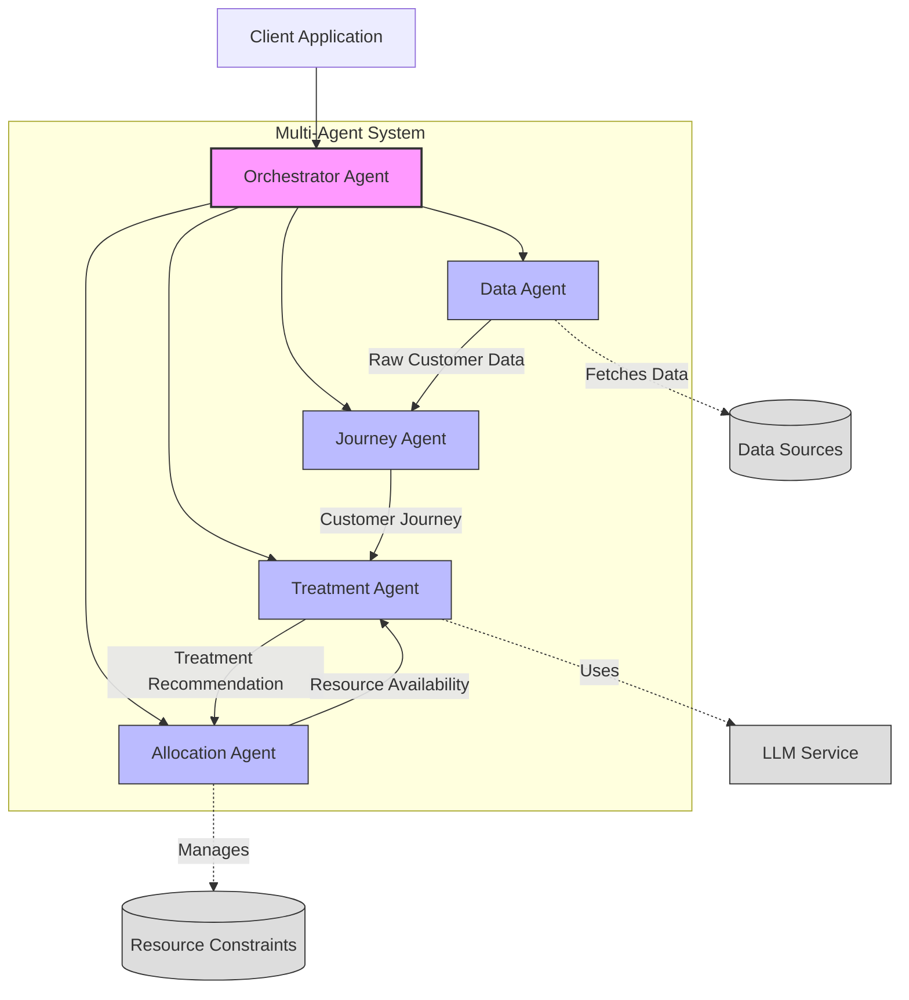
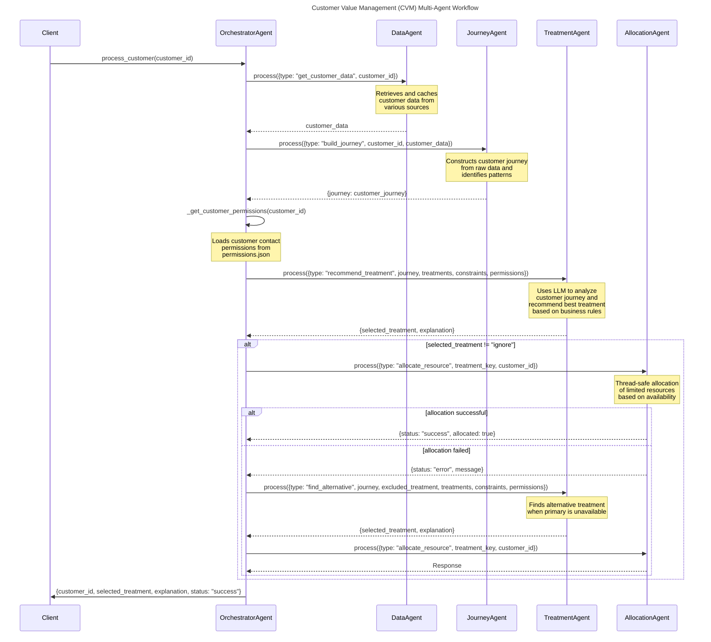

# CVM (Customer Value Management) System for Telecommunications

This is a proof of concept for a CVM (Customer Value Management) system for a telecommunications company. The goal of this project is to explore the use of AI to optimize customer-centric marketing strategies. This project is for educational purposes only and is not intended for real-world deployment.

## Quick Start

### Prerequisites
- Python 3.10 or higher
- Poetry (Python package manager)
- Access to OpenAI API (for GPT-4 integration)

### Local Setup
```bash
# Add Poetry to your PATH
export PATH="$HOME/.local/bin:$PATH" 

# Install dependencies
poetry install 

# Set up environment variables
cp .env.example .env
# Edit .env with your API keys and configuration
```

### Run Example
```bash
poetry run python src/machine_says.py --customer_id U124
```

## Project Structure
```
cvm_agents/
├── config/                 # Configuration files
│   └── cvm_config.yaml    # Main configuration
├── src/                   # Source code
│   ├── tools/            # Utility tools and APIs
│   │   └── api_v2.py    # Customer journey builder
│   ├── utils/           # Helper functions
│   │   └── config.py    # Configuration handler
│   └── machine_says.py   # Main entry point
├── tests/                # Test suite
│   ├── utils/           # Utility tests
│   │   └── test_config.py  # Configuration tests
│   └── conftest.py      # Test configuration
├── .env.example         # Example environment variables
├── poetry.lock         # Lock file for dependencies
├── pyproject.toml      # Project metadata and dependencies
└── README.md          # This file
```

## Developer Guide

### Development Setup
1. Clone the repository
2. Install Poetry (if not already installed):
   ```bash
   curl -sSL https://install.python-poetry.org | python3 -
   ```
3. Install dependencies:
   ```bash
   poetry install
   ```
4. Set up pre-commit hooks (recommended):
   ```bash
   poetry run pre-commit install
   ```

### Environment Variables
The following environment variables are required:
```
OPENAI_API_KEY=your_api_key_here
MODEL_ID=gpt-4o
LOG_LEVEL=INFO
```

### Running Tests
The project uses pytest for testing. To run the tests:

```bash
# Run all tests
poetry run pytest tests/

# Run tests with verbose output
poetry run pytest tests/ -v

# Run tests with coverage report
poetry run pytest tests/ --cov=src

# Run tests for a specific module
poetry run pytest tests/utils/test_config.py

# Generate HTML coverage report
poetry run pytest tests/ --cov=src --cov-report=html
```

### Test Structure
- `tests/` - Root test directory
  - `conftest.py` - Pytest configuration and fixtures
  - `utils/` - Tests for utility modules
    - `test_config.py` - Configuration module tests

### Configuration
The system uses YAML configuration files located in the `config/` directory:
- `cvm_config.yaml` - Main configuration file containing:
  - Treatment definitions
  - Constraints
  - Model settings
  - Validation rules
  - Global settings

### Code Style
- The project follows PEP 8 guidelines
- Type hints are required for all new code
- Docstrings should follow Google style
- Maximum line length is 88 characters (Black formatter)

### Development Workflow
1. Create a new branch for your feature/fix
2. Write tests for new functionality
3. Implement your changes
4. Ensure all tests pass
5. Run pre-commit hooks
6. Submit a pull request

### Debugging
Several debug options are available:

#### Debug Logging
```bash
# Detailed debug output
poetry run python src/machine_says.py --customer_id U124 --log_level DEBUG

# Minimal output
poetry run python src/machine_says.py --customer_id U124 --log_level WARNING
```

#### Debugging Tools
- Use `pytest -pdb` for debugging tests
- VSCode launch configurations are provided in `.vscode/launch.json`
- Debug logs are written to `logs/cvm.log`

## System Overview

This system employs several agents working together:

- **Offer Data Agent**: Provides dummy offer data for telecom services.
- **Recommender Model Agent**: Provides dummy recommender model data.
- **Usage Data Agent**: Provides dummy usage data for telecom services.
- **Price Data Agent**: Provides dummy price data for competitors.
- **Campaign Data Agent**: Provides dummy campaign data.
- **Customer Demographics Agent**: Provides dummy customer demographics data.
- **Network Performance Agent**: Provides dummy network performance data.

The system has been enhanced with a multi-agent architecture as described below.

## Multi-Agent Architecture

### Overview

The CVM multi-agent architecture divides the treatment selection process into specialized components, each responsible for specific aspects of the workflow. This modular approach improves maintainability, scalability, and allows for independent optimization of each component.

### Agent Architecture



### Agent Workflow

The following sequence diagram illustrates how agents interact to determine the best treatment for a customer:



### Agent Responsibilities

#### 1. Orchestrator Agent

The Orchestrator Agent is the central coordinator that manages the entire workflow:

- Initializes and coordinates all other agents
- Defines the sequence of operations for processing customers
- Handles error recovery and fallback strategies
- Aggregates results and produces the final output

The orchestrator follows a clear step-by-step process for each customer:
1. Request customer data from the Data Agent
2. Pass the data to the Journey Agent to build a customer journey
3. Retrieve customer permissions 
4. Request treatment recommendations from the Treatment Agent
5. Allocate resources using the Allocation Agent
6. Handle fallback scenarios when primary treatments aren't available

#### 2. Data Agent

The Data Agent is responsible for all data access operations:

- Retrieves customer data from various sources (files, databases)
- Implements caching for efficient repeat data access
- Handles data transformation and normalization
- Abstracts away data source complexity from other agents

The Data Agent supports operations such as:
- `get_customer_data`: Retrieves all data for a specific customer
- `clear_cache`: Clears the data cache when needed

#### 3. Journey Agent

The Journey Agent builds and analyzes customer journeys:

- Constructs comprehensive customer journey from raw data points
- Identifies patterns and trends in customer behavior
- Extracts key metrics and insights from journeys
- Creates summarized versions of journeys when needed

The Journey Agent supports operations such as:
- `build_journey`: Constructs a journey from raw customer data
- `analyze_journey`: Extracts insights from a journey
- `summarize_journey`: Creates a condensed version of a journey

#### 4. Treatment Agent

The Treatment Agent determines the optimal treatment for customers:

- Uses LLMs to analyze customer journeys and determine best treatments
- Applies business rules and customer permissions to recommendations
- Finds alternative treatments when primary choices are unavailable
- Provides explanations for treatment decisions

The Treatment Agent supports operations such as:
- `recommend_treatment`: Recommends optimal treatment based on customer journey
- `find_alternative_treatment`: Finds alternatives when primary treatment is unavailable

#### 5. Allocation Agent

The Allocation Agent manages resource allocation and constraints:

- Tracks availability of limited resources (e.g., call center slots)
- Ensures thread-safe updates to resource constraints
- Implements priority-based allocation for high-value customers
- Maintains allocation history for analysis

The Allocation Agent supports operations such as:
- `allocate_resource`: Attempts to allocate a resource for a treatment
- `check_availability`: Checks if a resource is available
- `get_constraints`: Returns current constraint status
- `reset_constraints`: Resets constraints to initial values

### Communication Flow

The agents communicate through a standardized message-passing interface:

1. Each agent implements a `process(message)` method that accepts messages with a `type` field
2. The message type determines which operation the agent will perform
3. Messages include all necessary data for the operation
4. Agents return responses that may be used as inputs to other agents

This approach allows for:
- Loose coupling between agents
- Easy testing of individual agents
- Future extension to distributed messaging systems

### Benefits of the Multi-Agent Architecture

1. **Modularity**: Each agent focuses on a specific aspect of the overall system
2. **Scalability**: Agents can be scaled independently based on workload
3. **Maintainability**: Changes to one agent's implementation don't affect others
4. **Extensibility**: New capabilities can be added as new agent types
5. **Resilience**: Failures in one agent can be contained without crashing the entire system
6. **Optimization**: Each agent can be optimized for its specific task
7. **Reusability**: Agents can be reused across different workflows

### Future Enhancements

The current implementation can be extended with:

1. **Evaluation Agent**: For assessing treatment effectiveness
2. **Customer Segmentation Agent**: For advanced customer categorization
3. **Messaging Infrastructure**: Replace direct method calls with message queues
4. **Distributed Processing**: Distribute agents across multiple servers
5. **A/B Testing Framework**: Test different agent strategies in parallel

## Contributing
1. Fork the repository
2. Create a feature branch
3. Commit your changes
4. Run the test suite
5. Submit a Pull Request

Please ensure your PR:
- Includes tests for new functionality
- Updates documentation as needed
- Follows the code style guidelines
- Includes a clear description of changes

## License
This project is licensed under the MIT License - see the LICENSE file for details.

## Disclaimer

This project is for educational and research purposes only.

- Not intended for real-world deployment.
- No warranties or guarantees provided.
- Creator assumes no liability for any losses.
- Consult a professional for real-world applications.
- By using this software, you agree to use it solely for learning purposes.