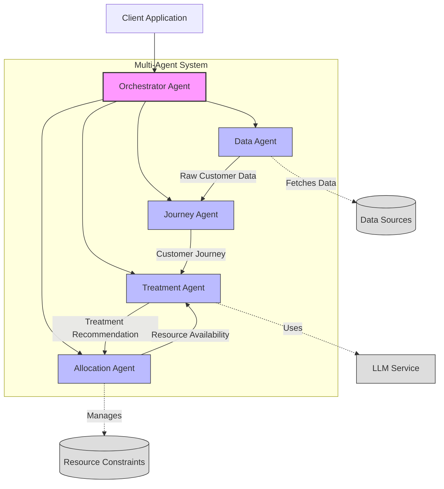

# Customer Value Management (CVM) Multi-Agent Architecture

## Overview

The CVM multi-agent architecture divides the treatment selection process into specialized components, each responsible for specific aspects of the workflow. This modular approach improves maintainability, scalability, and allows for independent optimization of each component.

## Agent Architecture

## Agent Responsibilities

### 1. Orchestrator Agent

The Orchestrator Agent is the central coordinator that manages the entire workflow:

- Initializes and coordinates all other agents
- Defines the sequence of operations for processing customers
- Handles error recovery and fallback strategies
- Aggregates results and produces the final output

The orchestrator follows a clear step-by-step process for each customer:
1. Request customer data from the Data Agent
2. Pass the data to the Journey Agent to build a customer journey
3. Retrieve customer permissions 
4. Request treatment recommendations from the Treatment Agent
5. Allocate resources using the Allocation Agent
6. Handle fallback scenarios when primary treatments aren't available

### 2. Data Agent

The Data Agent is responsible for all data access operations:

- Retrieves customer data from various sources (files, databases)
- Implements caching for efficient repeat data access
- Handles data transformation and normalization
- Abstracts away data source complexity from other agents

The Data Agent supports operations such as:
- `get_customer_data`: Retrieves all data for a specific customer
- `clear_cache`: Clears the data cache when needed

### 3. Journey Agent

The Journey Agent builds and analyzes customer journeys:

- Constructs comprehensive customer journey from raw data points
- Identifies patterns and trends in customer behavior
- Extracts key metrics and insights from journeys
- Creates summarized versions of journeys when needed

The Journey Agent supports operations such as:
- `build_journey`: Constructs a journey from raw customer data
- `analyze_journey`: Extracts insights from a journey
- `summarize_journey`: Creates a condensed version of a journey

### 4. Treatment Agent

The Treatment Agent determines the optimal treatment for customers:

- Uses LLMs to analyze customer journeys and determine best treatments
- Applies business rules and customer permissions to recommendations
- Finds alternative treatments when primary choices are unavailable
- Provides explanations for treatment decisions

The Treatment Agent supports operations such as:
- `recommend_treatment`: Recommends optimal treatment based on customer journey
- `find_alternative_treatment`: Finds alternatives when primary treatment is unavailable

### 5. Allocation Agent

The Allocation Agent manages resource allocation and constraints:

- Tracks availability of limited resources (e.g., call center slots)
- Ensures thread-safe updates to resource constraints
- Implements priority-based allocation for high-value customers
- Maintains allocation history for analysis

The Allocation Agent supports operations such as:
- `allocate_resource`: Attempts to allocate a resource for a treatment
- `check_availability`: Checks if a resource is available
- `get_constraints`: Returns current constraint status
- `reset_constraints`: Resets constraints to initial values

## Communication Flow

The agents communicate through a standardized message-passing interface:

1. Each agent implements a `process(message)` method that accepts messages with a `type` field
2. The message type determines which operation the agent will perform
3. Messages include all necessary data for the operation
4. Agents return responses that may be used as inputs to other agents

This approach allows for:
- Loose coupling between agents
- Easy testing of individual agents
- Future extension to distributed messaging systems

## Benefits of the Multi-Agent Architecture

1. **Modularity**: Each agent focuses on a specific aspect of the overall system
2. **Scalability**: Agents can be scaled independently based on workload
3. **Maintainability**: Changes to one agent's implementation don't affect others
4. **Extensibility**: New capabilities can be added as new agent types
5. **Resilience**: Failures in one agent can be contained without crashing the entire system
6. **Optimization**: Each agent can be optimized for its specific task
7. **Reusability**: Agents can be reused across different workflows

## Future Enhancements

The current implementation can be extended with:

1. **Evaluation Agent**: For assessing treatment effectiveness
2. **Customer Segmentation Agent**: For advanced customer categorization
3. **Messaging Infrastructure**: Replace direct method calls with message queues
4. **Distributed Processing**: Distribute agents across multiple servers
5. **A/B Testing Framework**: Test different agent strategies in parallel 