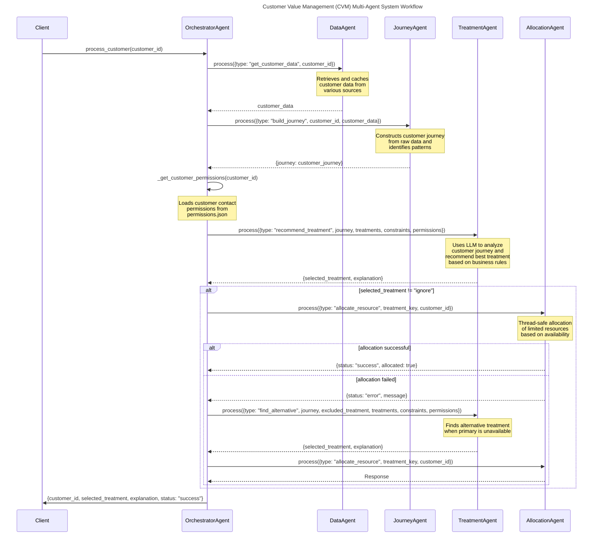

```mermaid
sequenceDiagram
    title Customer Value Management (CVM) Multi-Agent System Workflow
    
    participant Client
    participant Orchestrator as OrchestratorAgent
    participant Data as DataAgent
    participant Journey as JourneyAgent
    participant Treatment as TreatmentAgent
    participant Allocation as AllocationAgent

    Client->>Orchestrator: process_customer(customer_id)
    
    %% Data Collection Phase
    Orchestrator->>Data: process({type: "get_customer_data", customer_id})
    Note over Data: Retrieves and caches<br/>customer data from<br/>various sources
    Data-->>Orchestrator: customer_data
    
    %% Journey Building Phase
    Orchestrator->>Journey: process({type: "build_journey", customer_id, customer_data})
    Note over Journey: Constructs customer journey<br/>from raw data and<br/>identifies patterns
    Journey-->>Orchestrator: {journey: customer_journey}
    
    %% Permissions Retrieval
    Orchestrator->>Orchestrator: _get_customer_permissions(customer_id)
    Note over Orchestrator: Loads customer contact<br/>permissions from<br/>permissions.json
    
    %% Treatment Recommendation Phase
    Orchestrator->>Treatment: process({type: "recommend_treatment", journey, treatments, constraints, permissions})
    Note over Treatment: Uses LLM to analyze<br/>customer journey and<br/>recommend best treatment<br/>based on business rules
    Treatment-->>Orchestrator: {selected_treatment, explanation}
    
    %% Resource Allocation Phase
    alt selected_treatment != "ignore"
        Orchestrator->>Allocation: process({type: "allocate_resource", treatment_key, customer_id})
        Note over Allocation: Thread-safe allocation<br/>of limited resources<br/>based on availability
        
        alt allocation successful
            Allocation-->>Orchestrator: {status: "success", allocated: true}
        else allocation failed
            Allocation-->>Orchestrator: {status: "error", message}
            
            %% Find Alternative Treatment
            Orchestrator->>Treatment: process({type: "find_alternative", journey, excluded_treatment, treatments, constraints, permissions})
            Note over Treatment: Finds alternative treatment<br/>when primary is unavailable
            Treatment-->>Orchestrator: {selected_treatment, explanation}
            
            %% Try Allocating Alternative
            Orchestrator->>Allocation: process({type: "allocate_resource", treatment_key, customer_id})
            Allocation-->>Orchestrator: Response
        end
    end
    
    %% Result Creation
    Orchestrator->>Client: {customer_id, selected_treatment, explanation, status: "success"}
``` 