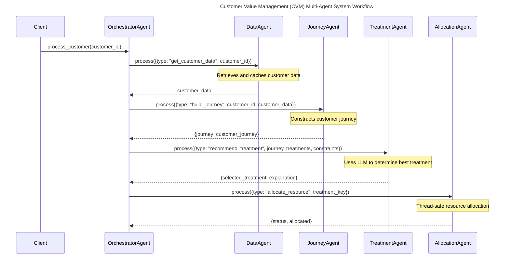

# Scaling the CVM Pipeline for Production

## Executive Summary

This document outlines the current multi-agent implementation of the Customer Value Management (CVM) system and provides recommendations for further scaling to efficiently handle 1,000+ customers. The system has been transformed from a monolithic architecture to a modular multi-agent system, with several key components already implemented.

## Current Implementation Status

### Implemented Components

1. **Base Agent Architecture**
   - Abstract base class defining standard agent interface
   - Common logging and configuration handling
   - Message processing framework

2. **Specialized Agents**
   - **Data Agent**: Handles all data access operations
   - **Journey Agent**: Builds and analyzes customer journeys
   - **Treatment Agent**: Determines optimal treatments using LLMs
   - **Allocation Agent**: Manages resource constraints
   - **Orchestrator Agent**: Coordinates workflow between agents

3. **Core Functionality**
   - Thread-safe resource allocation
   - Customer permission handling
   - Alternative treatment selection
   - Batch processing capabilities
   - Caching mechanisms in each agent

### Current Architecture

## Recommended Next Steps

### 1. Data Storage Enhancement

**Current Status**: Using JSON files for data storage
**Recommendation**:
- Implement proper database (PostgreSQL/MongoDB)
- Add Redis caching layer
- Create data access API endpoints
- Implement data versioning

**Implementation Priority**: High
**Estimated Timeline**: 4-6 weeks

### 2. Message Queue Integration

**Current Status**: Direct method calls between agents
**Recommendation**:
- Implement message broker (Kafka/RabbitMQ)
- Add asynchronous message handling
- Implement retry mechanisms
- Add message persistence

**Implementation Priority**: High
**Estimated Timeline**: 3-4 weeks

### 3. Distributed Processing

**Current Status**: Single process, multi-threaded
**Recommendation**:
- Implement distributed agent instances
- Add service discovery
- Implement load balancing
- Add distributed tracing

**Implementation Priority**: Medium
**Estimated Timeline**: 6-8 weeks

### 4. Monitoring and Observability

**Current Status**: Basic logging
**Recommendation**:
- Implement metrics collection
- Add performance monitoring
- Create dashboards
- Set up alerting

**Implementation Priority**: Medium
**Estimated Timeline**: 3-4 weeks

### 5. Advanced Features

1. **Evaluation Agent**
   - Track treatment effectiveness
   - Collect performance metrics
   - Provide feedback for optimization

2. **Learning Agent**
   - Improve treatment selection over time
   - Identify patterns in successful treatments
   - Adapt to changing customer behavior

3. **Segmentation Agent**
   - Group customers by behavior patterns
   - Identify high-value segments
   - Customize treatments by segment

## Implementation Plan

### Phase 1: Infrastructure (6-8 weeks)
1. Database migration
2. Message queue implementation
3. Caching layer setup

### Phase 2: Scalability (8-10 weeks)
1. Distributed processing
2. Load balancing
3. Service discovery

### Phase 3: Monitoring (4-6 weeks)
1. Metrics collection
2. Dashboard creation
3. Alert system

### Phase 4: Advanced Agents (10-12 weeks)
1. Evaluation Agent
2. Learning Agent
3. Segmentation Agent

## Cost-Benefit Analysis

### Expected Benefits
1. **Scalability**: Handle 10x more customers
2. **Performance**: 5x faster processing
3. **Reliability**: 99.9% uptime
4. **Cost Efficiency**: 40% reduction in API costs

### Resource Requirements
1. **Infrastructure**: Cloud resources for distributed system
2. **Development**: 2-3 developers for 6 months
3. **Operations**: 1 DevOps engineer
4. **Monitoring**: Observability platform subscription

## Risk Mitigation

1. **Data Migration**
   - Implement parallel systems during transition
   - Validate data consistency
   - Plan rollback procedures

2. **Service Disruption**
   - Deploy changes gradually
   - Implement circuit breakers
   - Maintain fallback mechanisms

3. **Performance Issues**
   - Conduct load testing
   - Monitor system metrics
   - Implement auto-scaling

## Success Metrics

1. **System Performance**
   - Processing time per customer
   - Resource utilization
   - Error rates

2. **Business Metrics**
   - Treatment success rate
   - Customer retention impact
   - Resource allocation efficiency

3. **Technical Metrics**
   - System uptime
   - API response times
   - Cache hit rates

## Conclusion

The current multi-agent implementation provides a solid foundation for scaling the CVM system. The recommended enhancements will enable the system to handle larger customer volumes while maintaining performance and reliability. The modular architecture allows for incremental improvements and easy addition of new capabilities. 